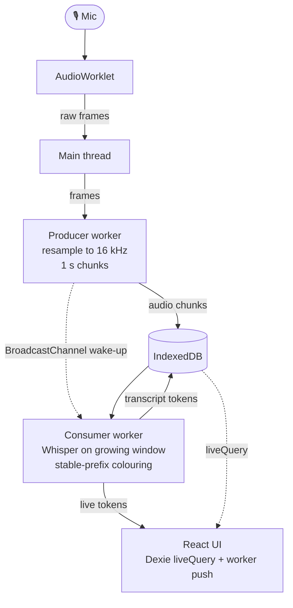

# Off The Record

Offline live transcription in the browser. Whisper runs locally. No backend. No audio leaves your machine.

## 🤫 Why

- Most live-transcription tools stream your audio to a server.
- Off The Record runs the entire pipeline in the tab.
- The only thing that leaves your machine is the initial model download.

## 🚦 Status

- Working concept.
- Being hardened toward production.
- See `PLAN.md` for the design spec and behavioural contract.

## 🚀 Quickstart

```bash
npm install
npm run dev
```

- Open the printed URL.
- Grant mic permission.
- Hit **Record**.
- First load downloads the selected model. Cached after that.

## 📜 Scripts

- `npm run dev`: Vite dev server with COOP/COEP headers.
- `npm run build`: type-check then production build to `dist/`.
- `npm run preview`: serve the production build locally.
- `npm run typecheck`: type-check without emitting.

## 🌐 Browser support

- **Chrome / Edge** (desktop): full support. WebGPU when available.
- **Firefox**: works on WASM. WebGPU gated.
- **Safari** (desktop): WASM only. Slower inference.
- **Mobile**: not a target right now.

Cross-origin isolation headers are required.

- `Cross-Origin-Opener-Policy: same-origin`
- `Cross-Origin-Embedder-Policy: require-corp`

Vite sets these for dev and preview. If you host the build elsewhere, set them at the edge.

## 🧠 Models

Picker lives in the header. Selection persists in `localStorage`.

- **`whisper-tiny.en`**: smallest, fastest. English only. Weaker on noise and accents.
- **`whisper-base.en`**: default. Good speed and quality for English.
- **`whisper-large-v3-turbo`**: best quality. Multilingual. Slower first load.

Weights cache in the browser's Cache API. Second load is instant. Clear via DevTools, Application, Cache Storage.

## 🏗️ How it works



- Two web workers decouple capture from inference.
- Audio chunks live in IndexedDB.
- `BroadcastChannel` is only a wake-up signal.
- Full design in `PLAN.md`.

## 🧰 Tech

- Vite, React 19, TypeScript, Tailwind.
- `@huggingface/transformers` for inference.
- Dexie for IndexedDB.
- `lucide-react` for icons.
- No backend.

## 💾 Storage

- **Model weights**: Cache API. Managed by transformers.js.
- **Audio chunks**: IndexedDB. Evicted as the committed-audio anchor advances.
- **Transcript tokens**: IndexedDB. Reconciled on each inference tick.
- **Preferences**: `localStorage`. Model selection only.

Clearing the transcript also clears chunk and token tables. Nothing else is persisted.
