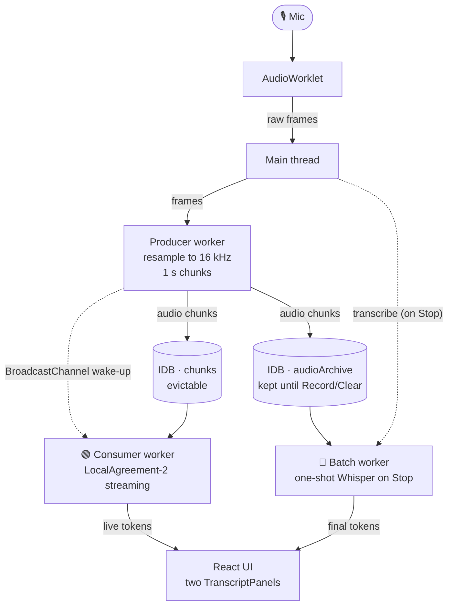

# Off The Record

Offline live transcription in the browser. Whisper runs locally. No backend. No audio leaves your machine.

## 🤫 Why

- Most live-transcription tools stream your audio to a server.
- Off The Record runs the entire pipeline in the tab.
- The only thing that leaves your machine is the initial model download.

## 🆚 Two transcripts side-by-side

The UI shows two panels at once:

- 🟢 **Live · LocalAgreement-2**: streams while you speak. Words appear grey, then commit to black as Whisper hypotheses agree across consecutive ticks.
- 🔵 **Batch · one-shot on Stop**: empty during recording. On Stop, the full audio is fed to Whisper in a single pass and the result lands in this panel.

Each panel has its **own model picker**, so you can:

- Compare LA-2 vs one-shot on the **same model** (algorithm-only comparison).
- Compare a fast live model (e.g. `tiny.en_timestamped`) against a high-quality batch model (e.g. `large-v3-turbo_timestamped`).

Each Record session is independent. Pressing Record wipes both transcripts and the audio archive, then starts a fresh recording.

## 🚦 Status

- Working concept.
- Being hardened toward production.
- See `PLAN.md` for the design spec and behavioural contract.

## 🚀 Quickstart

```bash
npm install
npm run dev
```

- Open the printed URL.
- Grant mic permission.
- Hit **Record**.
- First load downloads each selected model. Cached after that.

## 📜 Scripts

- `npm run dev`: Vite dev server with COOP/COEP headers.
- `npm run build`: type-check then production build to `dist/`.
- `npm run preview`: serve the production build locally.
- `npm run typecheck`: type-check without emitting.

## 🌐 Browser support

- **Chrome / Edge** (desktop): full support. WebGPU when available.
- **Firefox**: works on WASM. WebGPU gated.
- **Safari** (desktop): WASM only. Slower inference.
- **Mobile**: not a target right now.

Cross-origin isolation headers are required.

- `Cross-Origin-Opener-Policy: same-origin`
- `Cross-Origin-Embedder-Policy: require-corp`

Vite sets these for dev and preview. If you host the build elsewhere, set them at the edge.

## 🧠 Models

Each panel has its own picker. Selection persists in `localStorage` (separate keys for live and batch).

- **`whisper-tiny.en_timestamped`**: smallest, fastest. English only. Weaker on noise and accents.
- **`whisper-base.en_timestamped`**: default. Good speed and quality for English.
- **`whisper-large-v3-turbo_timestamped`**: best quality. Multilingual. Slower first load.

All entries are the `_timestamped` ONNX exports. They include the cross-attention outputs `transformers.js` needs to compute word-level timestamps via DTW. LocalAgreement-2 requires those timestamps.

Weights cache in the browser's Cache API. Second load is instant. Clear via DevTools, Application, Cache Storage.

If both panels pick the same model, the weights are shared via the Cache API (only one download). If they pick different models, both are downloaded and held in memory simultaneously.

## 🏗️ How it works



- Three web workers decouple capture, live inference, and batch inference.
- `chunks` is consumed and evicted by the live consumer as the committed-audio anchor advances.
- `audioArchive` keeps every chunk until a new Record or a Clear. It is the input to the batch worker.
- `BroadcastChannel` is the live wake-up signal. The batch worker is triggered by a direct main-thread message on Stop.
- Full design in `PLAN.md`.

## 🧰 Tech

- Vite, React 19, TypeScript, Tailwind.
- `@huggingface/transformers` for inference.
- Dexie for IndexedDB.
- `lucide-react` for icons.
- No backend.

## 💾 Storage

- **Model weights**: Cache API. Managed by transformers.js. Shared across both panels when the model is the same.
- **`chunks`**: IndexedDB. Evicted as the live consumer's committed-audio anchor advances.
- **`audioArchive`**: IndexedDB. Kept until next Record or Clear. Input to the batch worker.
- **`transcript`**: IndexedDB. Reconciled on each live inference tick.
- **Preferences**: `localStorage`. Two keys: live model and batch model.

Clearing wipes `chunks`, `transcript`, and `audioArchive`. Nothing else is persisted.
